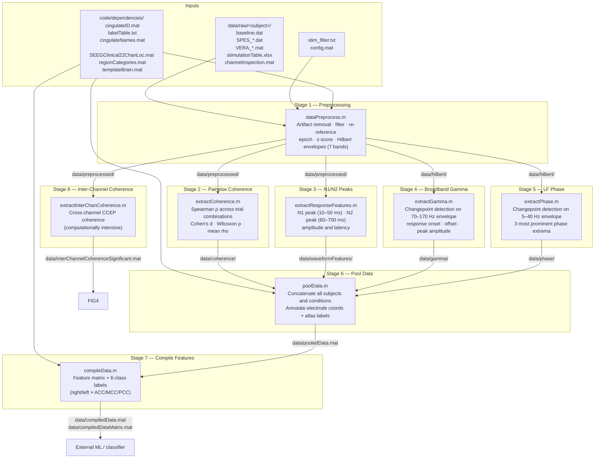

# Pipeline Architecture

This document maps the complete analysis pipeline: all entry points, inputs, processing stages, outputs, and figure generation scripts.

---

## Overview

```
Inputs → [Stage 1–8 Pipeline] → Intermediate outputs → Figure scripts → Manuscript figures
```

The pipeline is orchestrated by `main.m` at the repo root. Each stage reads its inputs from disk and writes outputs to `data/`, so any stage can be re-run independently.

---

## Entry Points

| File | Role |
|------|------|
| `main.m` | Full pipeline entry point — `run()`s each stage sequentially |
| `preflight.m` | First-run validation — checks data dependencies, environment, directories |
| `buildStimConfig.m` | Discovers all stimulation conditions in raw data and writes `stim_filter.txt` |
| `stim_filter.txt` | User-editable filter controlling which amplitudes, frequencies, regions, and epoch windows are processed |
| `config.mat` | Directory path configuration (rawDir, dataDir, etc.) |

---

## Pipeline Stages



---

## Figure Generation

All figures are generated by `code/engine/runFigures.m`, which calls each figure script in sequence.

| Script | Figure | Primary data source |
|--------|--------|---------------------|
| `code/figures/figure2.m` | Fig 2 — CCEP response maps + waveforms | `pooledData.mat` |
| `code/figures/figure3.m` | Fig 3 — Coherence distributions | `pooledData.mat` |
| `code/figures/figure4.m` | Fig 4 — Inter-channel network | `interChannelCoherenceSignificant.mat` |
| `code/figures/figure5.m` | Fig 5 — Broadband gamma features | `pooledData.mat` |
| `code/figures/figure6.m` | Fig 6 — LF phase features | `pooledData.mat` |
| `code/figures/figure7.m` | Fig 7 — Classifier performance | `compiledData.mat` |
| `code/figures/suppFig2.m` | Supp Fig 2 | `pooledData.mat` |
| `code/figures/suppFig3.m` | Supp Fig 3 | `pooledData.mat` |

Output: `data/figures/fig<N>.svg` / `.png`

> **Note:** Fig 1 and Supp Fig 1 require `pooledBrain.mat` (pre-computed brain mesh) and must be run manually.

---

## Directory Structure

```
cingulateConnectivity/
├── main.m                        # Full pipeline entry point
├── preflight.m                   # First-run validation
├── buildStimConfig.m             # Discovers stim conditions, writes stim_filter.txt
├── stim_filter.txt               # User-editable processing filter (auto-generated)
├── code/
│   ├── engine/                   # Pipeline orchestration scripts
│   │   ├── dataPreprocess.m      # Stage 1
│   │   ├── extractCoherence.m    # Stage 2
│   │   ├── extractResponseFeatures.m  # Stage 3
│   │   ├── extractGamma.m        # Stage 4
│   │   ├── extractPhase.m        # Stage 5
│   │   ├── poolData.m            # Stage 6
│   │   ├── compileData.m         # Stage 7
│   │   ├── extractInterChanCoherence.m  # Stage 8
│   │   └── runFigures.m          # Figure orchestration
│   ├── figures/                  # Individual figure scripts
│   │   ├── figure2.m … figure7.m
│   │   ├── suppFig2.m, suppFig3.m
│   │   └── clusterNetworkTool.m  # Interactive network explorer
│   ├── util/                     # Shared functions and preflight modules
│   │   ├── functions/            # Core shared library (preprocessData.m, processChannels.m, …)
│   │   └── preflight/            # pf_*.m validation modules
│   ├── dependencies/             # Static reference data (.mat, .txt, figpanels/)
│   └── legacy/                   # Archived exploratory scripts
└── data/
    ├── raw/                      # Input: per-subject raw BCI2000 data
    ├── preprocessed/             # Stage 1 output
    ├── hilbert/                  # Stage 1 output (Hilbert envelopes)
    ├── coherence/                # Stage 2 output
    ├── waveformFeatures/         # Stage 3 output
    ├── gamma/                    # Stage 4 output
    ├── phase/                    # Stage 5 output
    ├── pooledData.mat            # Stage 6 output
    ├── compiledData.mat          # Stage 7 output
    ├── compiledDataMatrix.mat    # Stage 7 output (ML-ready feature matrix)
    ├── interChannelCoherenceSignificant.mat  # Stage 8 output
    └── figures/                  # Figure output (.svg / .png)
```

---

## Data Flow Summary

| From | To | File(s) |
|------|----|---------|
| Raw .dat files | Stage 1 | `data/raw/<subj>/SPES_*.dat`, `baseline.dat` |
| Stage 1 | Stages 2, 3, 8 | `data/preprocessed/<subj>_<cond>_preprocessed.mat` |
| Stage 1 | Stages 4, 5 | `data/hilbert/<subj>_<cond>_hilbert.mat` |
| Stages 2–5 | Stage 6 | `data/coherence/`, `data/waveformFeatures/`, `data/gamma/`, `data/phase/` |
| Stage 6 | Stage 7, Figures 2–3, 5–6 | `data/pooledData.mat` |
| Stage 7 | Figure 7, external ML | `data/compiledData.mat`, `data/compiledDataMatrix.mat` |
| Stage 8 | Figure 4 | `data/interChannelCoherenceSignificant.mat` |
