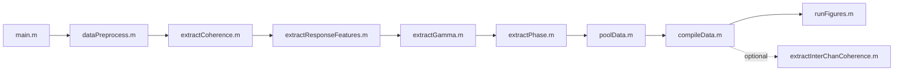

# cingulateConnectivity — project map

Scientific and structural reference for this MATLAB repository. Last updated: 2026-04 (full discovery pass).

---

## One-paragraph summary

**Science:** Human patients with epilepsy undergoing presurgical monitoring at Barnes Jewish Hospital have sEEG electrodes implanted across the cortex. Single-pulse electrical stimulation (SPES) of cingulate subregions (ACC, MCC, PCC) elicits **cortico-cortical evoked potentials (CCEPs)** at all recording sites. This project extracts six feature families from those CCEPs — coherence, N1/N2 peak morphology, broadband gamma, broadband LF phase/magnitude, and RMS — and pools them into a multi-feature connectivity model that characterizes how each cingulate subregion recruits the wider cortical network. A 6-class random forest model validates that these features are discriminative across stimulation sites. Simultaneous scalp EEG aims to resolve which of these intracranial signatures are detectable non-invasively.

**Engineering:** MATLAB repo, `addpath(genpath(cd))` from repo root, pipeline scripts in `code/engine/`, shared library in `code/util/functions/`, figure scripts in `code/figures/`, static metadata in `code/dependencies/`, preflight/setup tooling in `code/util/preflight/`, legacy/exploratory scripts in `code/legacy/`. Data entirely gitignored; must be restored locally before any analysis can run. Run `preflight.m` before first use.

---

## Anatomy / experimental design

### Cingulate subregion labels (FreeSurfer APARC2009 / Destrieux atlas)

| Region | Simple name (used in `cingulateNamesSimple`) | Full labels (`leftACC`, `rightACC`, etc. in `cingulateNames.mat`) |
|--------|----------------------------------------------|-------------------------------------------------------------------|
| ACC | `G_and_S_cingul-Ant` | `ctx_lh/rh_G_and_S_cingul-Ant`, `wm_lh/rh_G_and_S_cingul-Ant` |
| MCC-ant | `G_and_S_cingul-Mid-Ant` | `ctx_lh/rh_G_and_S_cingul-Mid-Ant`, `wm_lh/rh_G_and_S_cingul-Mid-Ant` |
| MCC-post | `G_and_S_cingul-Mid-Post` | `ctx_lh/rh_G_and_S_cingul-Mid-Post`, `wm_lh/rh_G_and_S_cingul-Mid-Post` |
| PCC-dorsal | `G_cingul-Post-dorsal` | `ctx_lh/rh_G_cingul-Post-dorsal`, `wm_lh/rh_G_cingul-Post-dorsal` |
| PCC-ventral | `G_cingul-Post-ventral` | `ctx_lh/rh_G_cingul-Post-ventral`, `wm_lh/rh_G_cingul-Post-ventral` |

### 6-class ML labels
1 = right ACC, 2 = left ACC, 3 = right MCC, 4 = left MCC, 5 = right PCC, 6 = left PCC

### Color scheme (used throughout all figures)
- ACC: **lush lilac** `[162, 127, 184]./255` (purple)
- MCC: **celadon porcelain** `[122, 191, 165]./255` (teal-green)
- PCC: **lago blue** `[34, 175, 194]./255` (cyan-blue)
- Method exemplar: **modern orange**

---

## Pipeline control flow

Each script is idempotent — it checks for output file existence before recomputing (`if ~isfile(saveFile)`).

---

## Stage-by-stage I/O

### 1. `dataPreprocess.m`

**Reads:**
- `data/raw/<BJH###>/baseline.dat` — BCI2000 baseline recording
- `data/raw/<BJH###>/baselineIDX.mat` — (optional) subset indices for baseline
- `data/raw/<BJH###>/channelInspection.mat` — per-subject channel removal/swap/EEG electrode list
- `data/raw/<BJH###>/stimulationTable.xlsx` — maps each .dat file to ch1, ch2, amplitude, frequency
- `data/raw/<BJH###>/<BJH###>_APARC2009_MNIbrain.mat` — VERA struct with MNI coordinates and atlas labels
- `data/raw/<BJH###>/ElectricalStimulation_1HzStim/ECOG001/<file>.dat` — sEEG recordings per stimulation condition
- `code/dependencies/cingulateID.mat` — atlas IDs for cingulate regions
- `code/dependencies/labelTable.txt` — full Destrieux atlas (Var1=ID, Var2=name)
- `code/dependencies/SEEGClinical22ChanLoc_xyz.mat` — scalp EEG channel locations (`EEGChans` struct with `.labels`)

**Writes (per condition file that stimulates a cingulate region at 6mA/0.5Hz):**
- `data/preprocessed/<BJH###>_<file>_<regionName>.mat` — full preprocessed data struct (see schema below)
- `data/hilbert/hilbertSEEG_<BJH###>_<file>_<regionName>.mat` — Hilbert-transformed band data for sEEG
- `data/hilbert/hilbertEEG_<BJH###>_<file>_<regionName>.mat` — Hilbert-transformed band data for scalp EEG
- `data/raw/<BJH###>/preprocessComplete.txt` — sentinel file to skip reprocessing

**Preprocessing steps (inside `preprocessData.m`):**
1. `load_bcidat` — load raw BCI2000 signal
2. `findStimulusOnset` — threshold-based (DC04 channel > 4e4) stimulus detection
3. Check if EEG channels exist (`channelInspection.eegElectrodes`)
4. `getCleanData` → highpass 0.5Hz (Butterworth order 5) + `removeArtifact` (bidirectional interpolation, 15-sample window) + multi-notch filter (60Hz harmonics)
5. `smallLaplace` — 5mm small Laplace re-referencing using MNI electrode coordinates
6. `commonAverageData` — common average reference (CAR)
7. `getLowPassData` — 40Hz Butterworth lowpass for CCEP visualization
8. `getAllBandpassedData` — 7 frequency bands (delta 1-3, theta 4-7, alpha 8-12, beta 13-25, lowGamma 25-50, broadbandGamma 70-170, broadbandLF 5-40 Hz) → Hilbert transform → epoch
9. `epochData` — ±0.95s around each stimulus onset (3800 samples at 2000 Hz)
10. `getZScore` — z-score each epoch to its own pre-stimulus baseline (1 to 0.9×sr samples)

**Preprocessed data struct fields:**
| Field | Type | Description |
|-------|------|-------------|
| `subjectName` | string | Subject ID (e.g., 'BJH062') |
| `stimulatedRegion` | {1×2 cell} | FreeSurfer labels of both stimulated channels |
| `stimulatedChannels` | [1×2 double] | Channel numbers within VERA |
| `stimulationAmplitude` | scalar | Current amplitude (mA) |
| `samplingRate` | scalar | 2000 Hz |
| `numTrials` | scalar | Number of stimulation events |
| `spesSmallLaplace` | ch×time×trial | Small Laplace rereferenced sEEG epochs |
| `spesSmallLaplaceZScore` | ch×time×trial | Z-scored version |
| `spesCAR` | ch×time×trial | Common average rereferenced sEEG epochs |
| `spesCARZScore` | ch×time×trial | Z-scored version |
| `lowPassSPES` | ch×time×trial | 40Hz lowpass, small Laplace epochs |
| `lowPassSPESZScore` | ch×time×trial | Z-scored version |
| `spesBroadbandGamma` | ch×time×trial | Z-scored abs(Hilbert) of 70-170Hz band |
| `surfaceEEG` | ch×time×trial | Scalp EEG (nan struct if no EEG channels) |
| `surfaceEEGZScore` | ch×time×trial | Z-scored scalp EEG (nan if no EEG) |
| `baseline.smallLaplace` | time×ch | Baseline small Laplace rereferenced |
| `baseline.CAR` | time×ch | Baseline CAR |
| `baseline.surfaceEEG` | time×ch | Baseline scalp EEG |
| `lowPassBaseline` | time×ch | Lowpassed baseline |
| `VERA` | struct | Contains `tala.electrodes` (N×3 MNI coords), `SecondaryLabel`, `channelNames`, `electrodeLabels`, `electrodeDefinition`, `tala.activations`, `tala.trielectrodes` |

**Hilbert struct fields** (for both `hilbertSEEG_*` and `hilbertEEG_*`):
Each field is ch×time×trial complex-valued:
`delta`, `theta`, `alpha`, `beta`, `lowGamma`, `broadbandGamma`, `broadbandLF`, `broadbandLFSignal`

---

### 2. `extractCoherence.m`

**Reads:** `data/preprocessed/<file>.mat` (`spesSmallLaplace`, `samplingRate`)

⚠️ **Bug:** Uses `load(dataFiles{dat})` without `dataDirectory` prefix — fails from repo root unless cwd = `data/preprocessed/`

**Windows:**
- Baseline: samples 1 to 0.85×sr (0 to 425ms pre-stim)
- Task: samples 0.95×sr to 0.95×sr + 0.7×sr (stimulus to 700ms post-stim)

**Method:** Pairwise Spearman cross-correlation across all unique trial pairs, per channel.

**Writes:**
- `data/coherence/coherence_<file>.mat` → `coherenceStruct.{baseline, task}` — ch×N_pairs matrices; `trialPairs` — N_pairs×2 pair indices
- `data/coherence/distribution_<file>.mat` → `distributionStruct.{cohensD, variance, pVal, rhoTask, rhoBase}` — 1×ch vectors

---

### 3. `extractResponseFeatures.m`

**Reads:** `data/preprocessed/<file>.mat` (`spesSmallLaplaceZScore`, `lowPassSPESZScore`, `samplingRate`)

⚠️ **Bug:** Same bare-load issue as extractCoherence.m

**Calls:** `getPeaks(spesSmallLaplaceZScore, samplingRate, lowPassSPESZScore)`

**Feature extraction windows:**
- N1: 10–50ms post-stim (samples `time/2 + sr*0.01` to `time/2 + sr*0.05`)
- N2: 60–700ms post-stim (samples `time/2 + sr*0.06` to `time/2 + sr*0.7`)
- Threshold: 5× baseline SD
- N1 peak: highest absolute amplitude (positive or negative); N2 uses lowpassed trace
- Response duration: N1 onset (half-width before N1) to N2 prominence crossover

**Writes:** `data/waveformFeatures/features_<file>.mat` → `responseStruct`:
| Field | Description |
|-------|-------------|
| `numPeaksN1`, `numPeaksN2` | Peak count in each window |
| `n1Polarity`, `n2Polarity` | +1 (positive) / -1 (negative) / 0 (none) |
| `n1Amplitude`, `n2Amplitude` | Peak amplitude (z-scored) |
| `n1Latency`, `n2Latency` | Sample index of peak |
| `n1Width`, `n2Width` | Peak width in samples |
| `n1Prominence`, `n2Prominence` | Prominence value |
| `responseDuration` | Duration from N1 onset to N2 prominence crossover (seconds) |
| `n1PeakToBaseline` | Proportion of trials exceeding threshold at N1 location |
| `RMS` | RMS of mean CCEP over response window |

---

### 4. `extractGamma.m`

**Reads:** `data/preprocessed/<file>.mat` (for samplingRate); `data/hilbert/hilbertSEEG_<file>.mat` (`broadbandGamma`)

**Windows:**
- Baseline: 1 to 0.9×sr
- Task: 1.05×sr to (0.95×sr)×2 (excludes stimulus artifact and N1)

**Method:** Z-score abs(broadbandGamma) → compute mean trace → `findchangepts` (MaxNumChanges=2, Statistic="mean") for onset/offset

**Writes:** `data/gamma/gamma_<file>.mat`:
| Field | Description |
|-------|-------------|
| `meanGamma` | ch×time mean z-scored gamma envelope |
| `stdGamma` | ch×time std |
| `rho` | Spearman correlation with binary baseline/task label |
| `p` | p-value of correlation |
| `amplitude` | Mean gamma in response window |
| `responseStart`, `responseStop` | Changepoint indices |
| `responseDuration` | Duration (seconds) |
| `peakGamma` | Peak z-scored gamma in response window |
| `peakGammaLatency` | Sample index of peak |

---

### 5. `extractPhase.m`

**Reads:** `data/preprocessed/<file>.mat` (for samplingRate); `data/hilbert/hilbertSEEG_<file>.mat` (`broadbandLF`)

**Windows:**
- Baseline: 1 to 0.9×sr
- Task: 0.95×sr to 0.95×sr + 0.95×sr

**Method:**
- Magnitude: z-score abs(broadbandLF) → `findchangepts` on diff(meanMag) ("rms") and meanMag ("linear") for onset/offset
- Temporal distortion correction: `estimateTemporalDistortion(2000, 5, 40, 3)` to get minimum valid start index
- Angle: `normalizeAngle` (cos(trial_angle − mean_angle) × mean_angle) → `characterizeAngleResponse` → top 3 extrema by magnitude within response window

**Writes:** `data/phase/phase_<file>.mat`:
| Field | Description |
|-------|-------------|
| `angle` | ch×time normalized angle of broadbandLF |
| `magnitude` | ch×time mean z-scored magnitude |
| `angleCharacterization` | ch×3 — amplitude of 3 most prominent angle extrema |
| `angleCharacterizationTime` | ch×3 — sample indices (relative to response start) |
| `magnitudeStart`, `magnitudeStop` | Response onset/offset in ms (from time vector) |
| `startIDX`, `endIDX` | Response onset/offset in samples |
| `magnitudeDuration` | Duration (seconds) |
| `peakMagnitude` | Peak magnitude value |
| `peakMagnitudeLatency` | Sample index of peak |

---

### 6. `poolData.m`

**Reads:** All preprocessed, coherence/distribution, waveformFeature, gamma, phase, and hilbert files. Also loads `code/dependencies/cingulateID.mat`, `labelTable.txt`, `SEEGClinical22ChanLoc_xyz.mat`.

**Writes:** `data/pooledData.mat` — single struct pooling all channels across all subjects. Key fields:

| Field category | Fields |
|----------------|--------|
| Coherence | `cohensD`, `variance`, `pValue`, `rhoCCEP`, `rhoBase` |
| Identity | `subjectID`, `channelNumber`, `electrodeRegionLabel`, `electrodeName`, `electrodeCoordinates` (3×N), `stimulatedChannels` (logical), `stimulatedChannelCoord` (3×N midpoints) |
| Data pointers | `dataFileName`, `coherenceFileName`, `coherenceDistFileName` |
| CCEP waveforms | `CCEPs` (time×N, median across trials, downsampled ×3) |
| Scalp EEG | `EEG` (time×N_eeg), `EEGChans`, `EEGChannelNumber`, `EEGStimulatedRegion`, `EEGERP` |
| Stimulation | `stimulatedRegion` (1×N cell, FreeSurfer label of stimulated region) |
| N1 features | `n1PeakNumber`, `n1Polarity`, `n1Amplitude`, `n1Latency`, `n1Width`, `n1Prominence`, `n1PeakToBaselineRatio` |
| N2 features | `n2PeakNumber`, `n2Polarity`, `n2Amplitude`, `n2Latency`, `n2Width`, `n2Prominence` |
| RMS | `RMS` (1×N), `RMSP` (p-values from signrank baseline vs task) |
| Phase/magnitude | `angleCharacteristics` (3×N), `angleCharacteristicsTime` (3×N), `responseAngles` (time×N), `responseMagnitude` (time×N), `responseStartTime`, `responseEndTime`, `responseStartTimeIDX`, `responseEndTimeIDX`, `responseDurationByAbruptChanges`, `responseLatency`, `responsePeakMagnitude`, `responsePeakMagnitudeTime` |
| Gamma | `gamma` (time×N mean), `stdGamma`, `gammaRho`, `gammaP`, `gammaAmplitude`, `gammaStart`, `gammaEnd`, `gammaDuration`, `gammaPeak`, `gammaPeakLatency` |

---

### 7. `compileData.m`

**Reads:** `data/pooledData.mat`

**Writes:**
- `data/compiledData.mat` — struct array `data(i)` with 44 scalar feature fields + `label` (1–6)
- `data/compiledDataMatrix.mat` — `dataMat` (N×45 numeric) + `dataMatKey` (field names)

**The 44 feature columns (dataMat cols 1–44):** pValue, cohensD, variance, rhoCCEP, rhoBase, rms, responseLatency, responseStart, responseEnd, responseDuration, responsePeakMagnitude, responsePeakLatency, firstAngle, secondAngle, thirdAngle, firstAngleTime, secondAngleTime, thirdAngleTime, startingAngle, endAngle, n1Amplitude, n1Latency, n1PeakNumber, n1PeakToBaselineRatio, n1Polarity, n1Prominence, n1Width, n2Amplitude, n2Latency, n2PeakNumber, n2Polarity, n2Prominence, n2Width, gammaRho, gammaP, gammaAmplitude, gammaStart, gammaEnd, gammaDuration, gammaPeak, gammaPeakLatency, xCoord, yCoord, zCoord. Col 45 = label.

---

### 8. `extractInterChanCoherence.m` (optional)

**Reads:** `data/pooledData.mat` (electrodeCoordinates, CCEPs, electrodeRegionLabel, stimulatedChannels, stimulatedRegion, pValue, cohensD), `code/dependencies/regionCategories.xlsx`

**Method:** For each condition (ACC, MCC, PCC) × each pair of brain regions: cross-correlation of CCEP traces in baseline and task windows across significant channels; Wilcoxon signed-rank test; Cohen's d.

**Writes:** `data/interChannelCoherenceSignificant.mat` → `interChannelCoherence.<ACC/MCC/PCC>.{taskCoherence, baselineCoherence, pValue, cohensD, baseCoherenceAll, CCEPCoherenceAll, labels, baseLag, taskLag}`

---

## Figure scripts

| Script | runFigures? | Key inputs | Manuscript role |
|--------|-------------|------------|-----------------|
| `figure1.m` | No | `pooledBrain.mat`, `pooledData.mat`, `regionCategories.xlsx` | Methods, electrode coverage, CC subregion coverage, exemplar CCEPs |
| `figure2.m` | Yes | `pooledData.mat`, `compiledData.mat`, `templateBrain.mat`, `cingulateNames.mat` | Coherence distributions, connectivity maps |
| `figure3.m` | Yes | Same + `pooledBrain.mat` | Spatial distribution of connectivity across brain |
| `figure4.m` | Yes | `interChannelCoherenceSignificant.mat`, `templateBrain.mat` | Inter-cingulate network coherence heatmaps (ACC/MCC/PCC × regions) |
| `figure5.m` | Yes | `pooledData.mat`, `compiledData.mat`, `pooledBrain.mat` | Temporal dynamics — response latency distributions |
| `figure6.m` | Yes | Same as figure5 + gammaP | Gamma response vs effective connectivity |
| `figure7.m` | Yes | `randomForestResults/result.mat`, `pooledData.mat` | ML classification validation |
| `suppFig1.m` | No | Same as figure2 + `pooledBrain.mat` | Participant coverage by region |
| `interCingulateConnectivity.m` | Yes (as Supp2) | Same as figure2 + `pooledBrain.mat` | Circular divergent network plot, geometric mean coherence map |
| `rmsConnectivity_Supp3.m` | Yes | Same as figure2 (uses RMSP significance) | RMS spatial connectivity comparison (Supp Fig 3) |
| `supplementalAllFeaturesAllRegions.m` | No | `pooledData.mat`, all dependencies | Comprehensive PDF: all features across all regions per condition |
| `supplementalFigureRegionLegends.m` | No | likely pooledData | Region color legend panels |
| `clusterNetworkTool.m` | No | `interChannelCoherenceSignificant.mat`, brain templates | Interactive visualization tool for inter-channel coherence |
| `electrodeCoverage.m` | No | `pooledData.mat` | Stub — incomplete, only 15 lines |

**All figure scripts save to:** `figures/main/figure<N>/dependencies/` (gitignored)

**PEABrain dependency:** figures 2, 3, 5, 6, suppFig1, supplementalAllFeaturesAllRegions, interCingulateConnectivity, rmsConnectivity_Supp3 all call `addpath(genpath('/Volumes/Samsung_T5/PEABrain'))` — provides `cortOut` struct with cingulate surface meshes and `plotProjectedRegionsOnly`.

---

## Key utility functions

### Signal processing
| Function | Signature | Purpose |
|----------|-----------|---------|
| `preprocessData` | `(filepath, baseline, EEGChannels, channelInspection, channelID, VERA, subject, stimAmplitude, stimChannels)` → `[data, hilbertOutSPES, hilbertOutEEG]` | Full per-file CCEP preprocessing |
| `getCleanData` | `(signal, samplingRate, stimulationIndex, stimulationWindow)` | Highpass + artifact removal + notch filtering |
| `removeArtifact` | `(signal, stim_start, win_l)` | Bidirectional interpolation across stimulus |
| `findStimulusOnset` | `(stimulus, threshold)` | Threshold crossing detector |
| `smallLaplace` | `(signal, ch_locations, distance, excluded_ch)` | 5mm spatial Laplace re-reference |
| `commonAverageData` | `(signal)` | Common average reference |
| `getLowPassData` | `(signal, threshold, order, SamplingRate)` | Butterworth lowpass |
| `getAllBandpassedData` | `(input, samplingRate, stimulusCodes, stimulusConditions, timeBefore, timeAfter)` | All bands → Hilbert → epoch |
| `epochData` | `(signal, stimulusCodes, stimulusConditions, timeBefore, timeAfter, samplingRate)` | Epoch to ch×time×trial |
| `getZScore` | `(input, baselineWindow)` | Trial-by-trial z-score to pre-stim baseline |
| `processChannels` | `(VERA, channelInspection, stimTable, ChannelNames, regionNames, stimAmp, stimFreq)` | Align VERA↔data channels, populate stimTable anatomical IDs |
| `importBaseline` | `(directory)` | Load BCI2000 baseline, handle multiple stimulus code formats |
| `removeNonExistantChannels` | `(VERA, indices)` | Remove channels from all VERA fields |
| `switchVERAChannels` | `(VERA, from, to)` | Swap channel order in VERA |

### Feature extraction
| Function | Signature | Purpose |
|----------|-----------|---------|
| `getCoherenceSingleChannel` | `(data, baselineWindow, taskWindow)` → `coherenceStruct` | Pairwise Spearman correlations across trial pairs |
| `getDistributionInfo` | `(taskIn, baseIn, trialPairs)` → `distributionStruct` | Cohen's d, variance, p-value, mean rho per channel |
| `getPeaks` | `(data, samplingRate, lowPass)` → `peaks` | N1/N2 peak features from mean CCEP |
| `getGammaFeatures` | `(input, samplingRate, baselineWindow, taskWindow)` → `gamma` | Gamma envelope features via changepoint detection |
| `getPhaseFeatures` | `(input, samplingRate, baselineWindow, taskWindow, numPhases)` → `phase` | Broadband LF magnitude/phase features |
| `characterizeAngleResponse` | `(rawData, window, thresh, nPeaks, vis)` | Extract top N angle extrema from response window |
| `normalizeAngle` | `(angleIn)` | Normalize angle across trials: cos(trial−mean)×mean |
| `estimateTemporalDistortion` | `(samplingRate, HP_cutoff, LP_cutoff, order)` | Estimate filter smearing to set min valid changepoint index |
| `getN1Latency` | `(data, window, threshold)` | Alternative N1 latency detector (not in main pipeline) |
| `getChanChanCoherence` | — | Alternative inter-channel coherence (not in main pipeline) |
| `getCoherenceR` | `(data, baselineWindow, taskWindow)` → ch×ch×pairs coherence | Channel×channel pairwise coherence |
| `getCoherenceForAllChannels` | `(signal, f_corr, N)` | Generic pairwise correlation across all channel pairs |

### Statistics
| Function | Purpose |
|----------|---------|
| `computeCohenD(x1, x2, 'independent'/'paired')` | Cohen's d effect size |
| `calculateAlphaThreshold(pValues, desiredFDR)` | Benjamini-Hochberg FDR threshold |
| `getDistributionInfo` | Cohen's d, variance, ranksum p-value per channel |
| `bootstrapCI` | Bootstrap confidence intervals |
| `bonf_holm` | Bonferroni-Holm correction |
| `calcPLevel` | p-level utility |
| `compareBinProportions`, `compareDistributions` | Distribution comparison utilities |
| `moransI` | Moran's I spatial autocorrelation |
| `spearmanCrossCorr` | Spearman cross-correlation |

### Visualization (generateFigures/)
| Function | Purpose |
|----------|---------|
| `generateNetworkPlot(outerCircleTable, innerCircleTable, dataStruct, dataFieldName, inclusionArray, overlapStyle)` | Circular divergent connectivity plot with curved spline connections |
| `generateNetworkPlotHalfCircle` | Variant of above |
| `plotProjectedRegions(structIn, colors, eColors, radius)` | Render cingulate surface meshes + electrodes |
| `plotProjectedRegionsOnly(structIn, colors)` | Render surface meshes only |
| `plotBallsOnVolume(ax, coords, color, radius)` | Render electrode spheres on 3D brain |
| `plot3DModel(ax, model, annotation)` | Render generic 3D surface mesh |
| `timeTraceFigure` | Time-series CCEP trace figure |
| `envelopeFigure` | Envelope/magnitude figure |
| `electrodeEffectSizes` | Effect size mapped to electrode positions |
| `electrodeEffectSizesOnVolume` | (variant) |
| `leftRightViolin(data, groupLabels, colors)` | Dual-sided violin plot |
| `scatterDistribution1D` | 1D scatter + distribution |
| `curvedSpline3D` | 3D spline curve for connectivity arrows |
| `isolatePortionOfModel` | Extract subregion from 3D model |
| `getColors(schemeName)` | Named color palette (see color scheme above) |
| `create2ColorGradient` | Two-color gradient for colormaps |
| `createColormapFromAnnotations` | Annotation-driven colormap |
| `extractSurface` | Extract mesh from VERA/surface data |
| `generateCircleNetworkPoints` | Compute circle layout coordinates |
| `getSubplotDimensions(n)` | Optimal subplot rows×cols |
| `hex2rgb` | Hex to RGB |
| `jbfill` | Shaded region fill |

### Other utilities
| Function | Purpose |
|----------|---------|
| `appendLog(header, comments, results)` | Write/update section in `data/analysisLog.txt` |
| `groupByRegions`, `groupData`, `organizeDataByRegions` | Group pooled data by anatomical region |
| `AverageResponseByRegions` | Average CCEPs by region |
| `getWaveforms` | Extract waveform segments |
| `getRMS(signal, baselineWindow, taskWindow)` | RMS difference (task − baseline) per channel/trial |
| `getEnvelope`, `getHilbert` | Signal envelope / Hilbert transform |
| `getPhase` | Extract instantaneous phase |
| `bandPassData(signal, fLow, fHigh, order, sr)` | Butterworth bandpass |
| `rescaleMatrixDimension(mat, range, dim)` | Normalize matrix along dimension |
| `normalizeToRange(data, minOut, maxOut)` | Rescale to output range |
| `flattenCell`, `countStrings` | Cell array utilities |
| `get3DSubsets`, `getOneSide`, `getHemiStats` | Hemisphere/spatial subset utilities |
| `getResampledData` | Resample data |
| `findOptimalClusterThreshold` | Clustering utilities |
| `getRegionsInClusters` | Map regions to clusters |
| `oneDCluster` | 1D clustering |
| `createWeightMatrix` | Weighted adjacency matrix |
| `computeTimeFreq` | Time-frequency analysis |
| `triangularGeoMean` | Geometric mean of triangular region |
| `ACAR` | Adaptive CAR |
| `CRP_method` | Change-point detection |
| `compareSpatialCentroids` | Spatial centroid comparison |
| `chi2TestThreeDistributions` | Chi-squared test |
| `getUniqueCorrelations(data1, data2, 'cross')` | Unique pairwise cross-correlations with lag |

---

## Dependencies (code/dependencies/)

| File | Contents |
|------|----------|
| `cingulateID.mat` | Vector of Destrieux atlas IDs corresponding to cingulate regions |
| `cingulateNames.mat` | Variables: `leftACC`, `rightACC`, `leftMCC`, `rightMCC`, `leftPCC`, `rightPCC`, `cingulateNamesSimple` — full FreeSurfer label strings including ctx_lh/rh and wm_lh/rh prefixes |
| `labelTable.txt` | Full Destrieux atlas: Var1=atlas ID, Var2=region name |
| `SEEGClinical22ChanLoc_xyz.mat` | `EEGChans` struct with `.labels` (22 scalp EEG channel names and XYZ locations) |
| `regionCategories.xlsx` | Table with `Name` (Destrieux region short name) and `Class` (brain region category, e.g. 'Frontal Lobe', 'Cingulate cortex', 'Hippocampus') |
| `templateBrain.mat` | `templateBrain.regions` struct (one field per region, each with `.tri`, `.vert`); `templateBrain.regionList` |
| `templateLHip.mat`, `templateRHip.mat` | Hippocampus surface templates |
| `listAmyg.mat`, `listHip.mat` | Cell arrays of amygdala and hippocampus region label strings |
| `mniMRI.mat` | MNI standard brain MRI volume |

---

## Git vs local-only (`.gitignore`)

| Ignored path | Meaning |
|--------------|---------|
| `/data` | All raw, preprocessed, and derived analysis products |
| `/code/util/eeglab2022.0` | Vendored EEGLAB 2022.0 |
| `/code/util/tools` | BCI2000 tooling (provides `load_bcidat`) |
| `/figures` | Exported figure outputs written by code/figures/ scripts |
| `/manuscript` | Manuscript Word/PDF/PPTX and submission packages (local only) |

**Tracked figure assets:** `code/figures/figures/main/` — SVG/PNG panel dependencies committed to git (figure2, figure5 have committed SVG/PNG subpanels).

**Fresh clone is NOT runnable** without: data/, EEGLAB, BCI2000 tools, and PEABrain (for figures).

---

## Known bugs and technical debt

| Location | Severity | Issue |
|----------|----------|-------|
| `extractCoherence.m:25` | High | `load(dataFiles{dat},'spesSmallLaplace','samplingRate')` — no `dataDirectory` prefix; fails from repo root |
| `extractResponseFeatures.m:24` | High | `load(dataFiles{dat})` — same bare-load issue |
| `getAllBandpassedData.m:45` | High | `out.broadbandLFSignal = epochData(broadBandLF,...)` — `broadBandLF` was cleared 5 lines earlier; will error |
| Figures 2,3,5,6,supp,rmsSupp3,interCingulate | Medium | Hardcoded `addpath(genpath('/Volumes/Samsung_T5/PEABrain'))` — brittle; use relative path or config variable |
| `extractHilbert.m` | Medium | Near-duplicate of `extractPhase.m`; saves with wrong prefix `phase_` to `data/hilbert/`; purpose unclear — may be dead code |
| `extractInterChanCoherence_old.m` | Low | Legacy version superseded by `extractInterChanCoherence.m`; can be deleted |
| `code/secondaryStatsandFigs.m` | Low | Loads from `data/processed/data.mat` — old pipeline path; incompatible with current structure |
| `code/channelInspectionScript.m` | Info | Now a guided per-subject setup script (rewritten 2026-04-06); parameterized, with inline instructions for channel alignment. Run before dataPreprocess for each new subject. |
| `extractForTrajectories.m:35` | Low | Saves to hardcoded absolute path `/Volumes/Samsung_T5/ccepTrajectories/data.mat` |
| `figure5.m:1` comment | Cosmetic | Says "figure 2" in the comment header; should say "figure 5" |
| `appendLog` | Info | Uses deprecated `datestr(now)` — works but will warn in newer MATLAB; replace with `char(datetime('now'))` |
| `electrodeCoverage.m` | Info | Incomplete stub — only 10 lines, no output |
| `getRMS.m:3` | Low | Uses `nans(...)` — should be `nan(...)` (may fail in some MATLAB versions) |

---

## Manuscript

Present on a full checkout of this machine’s working copy but **not in git** (see `.gitignore`). Layout for reference:

| Folder | Contents |
|--------|----------|
| `manuscript/documents/draftDocs/` | Active section drafts: Introduction, Methods, Results, Discussion, Figure Legends, Supplemental Figure Legends |
| `manuscript/documents/main/` | Full draft versions v1–v7 with author comment variants (PDv5: SH, ECL, PL, JTW, Murphy; PDv6, PDv7) |
| `manuscript/documents/submissions/PNAS/` | PNAS submission package |
| `manuscript/documents/submissions/scienceAdvances/` | Science Advances submission + combined PDF |
| `manuscript/documents/submissions/imagingNeuroscience/` | Imaging Neuroscience submission |
| `manuscript/figures/figuresMain.pptx` | Main figures PowerPoint |

Current active drafts: `CC_effectiveConnectivity_main_PDv7_NoComments.docx`, `CC_effectiveConnectivity_Supplemental.docx`

---

## Root-level entry points

| Script | Purpose |
|--------|---------|
| `main.m` | Unified entry point — runs full pipeline (`code/engine/`) then figure generation; each stage annotated with a summary comment |
| `preflight.m` | First-run setup — validates data dependencies, configures paths, writes `config.mat` |
| `buildStimConfig.m` | Discovers stimulation conditions across all subjects and writes `stim_filter.txt` |

## code/legacy/ — archived scripts

Scripts no longer part of the active pipeline. Tracked in git but not called by any entry point.

| Script | Notes |
|--------|-------|
| `extractForTrajectories.m` | One-off: builds trial-level CCEP dataset for trajectory/manifold analysis |
| `extractHilbert.m` | Near-duplicate of `extractPhase.m`; purpose unclear — may be dead code |
| `extractInterChanCoherence_old.m` | Superseded by `code/engine/extractInterChanCoherence.m` |
| `plotInterChanCorr.m` | Inter-channel correlation plotting utility; not part of main pipeline |
| `testGammaMap.m` | Exploratory gamma feature mapping tests |
| `uMapRun.m` | UMAP on compiled feature matrix (exploratory) |
| `clusteringTest.m`, `clusteringTest2.m` | Exploratory clustering tests |
| `main_v1.m` | Early pipeline prototype |
| `testViolin.m` | Violin plot testing |

---

## Known issues / open work

| Location | Severity | Issue |
|----------|----------|-------|
| `code/engine/extractCoherence.m:25` | High | Bare `load(dataFiles{dat},...)` — no `dataDirectory` prefix; fails from repo root |
| `code/engine/extractResponseFeatures.m:24` | High | Same bare-load issue |
| `getAllBandpassedData.m:45` | High | `out.broadbandLFSignal` references `broadBandLF` after it was cleared |
| 8+ figure scripts | Medium | Hardcoded `addpath(genpath('/Volumes/Samsung_T5/PEABrain'))` — breaks if PEABrain moves |
| `code/secondaryStatsandFigs.m` | Low | Loads from `data/processed/data.mat` — old pipeline path; incompatible with current structure |
| `code/channelInspectionScript.m` | Info | Guided per-subject setup script (rewritten 2026-04-06); run before `dataPreprocess.m` for each new subject |
